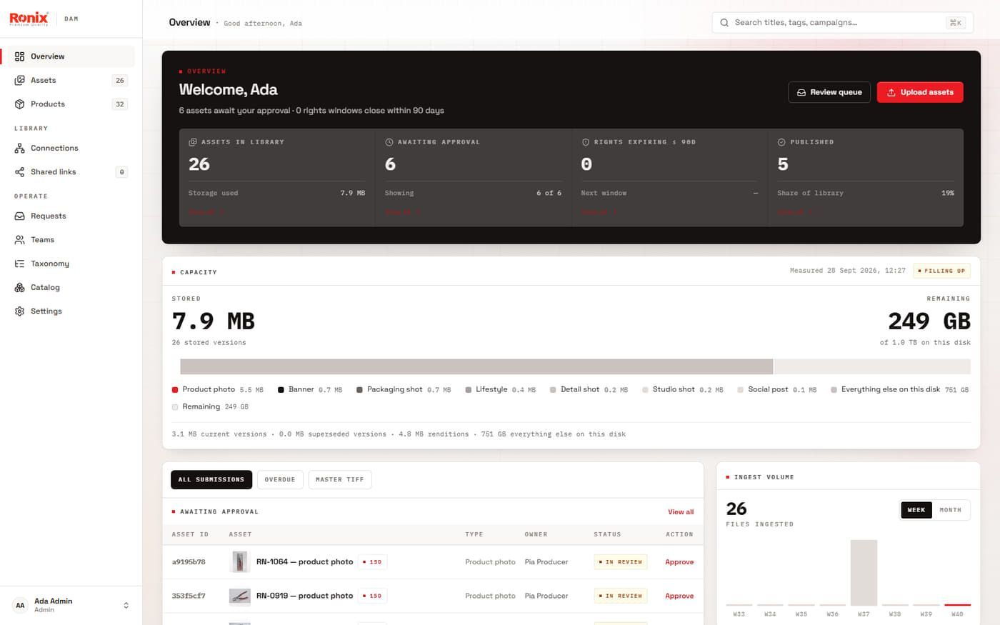
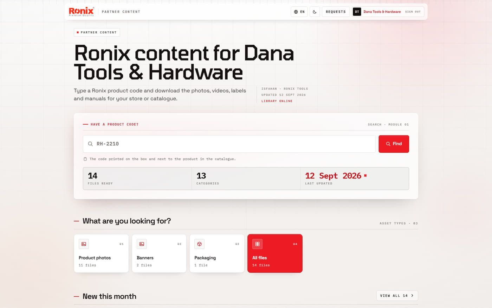
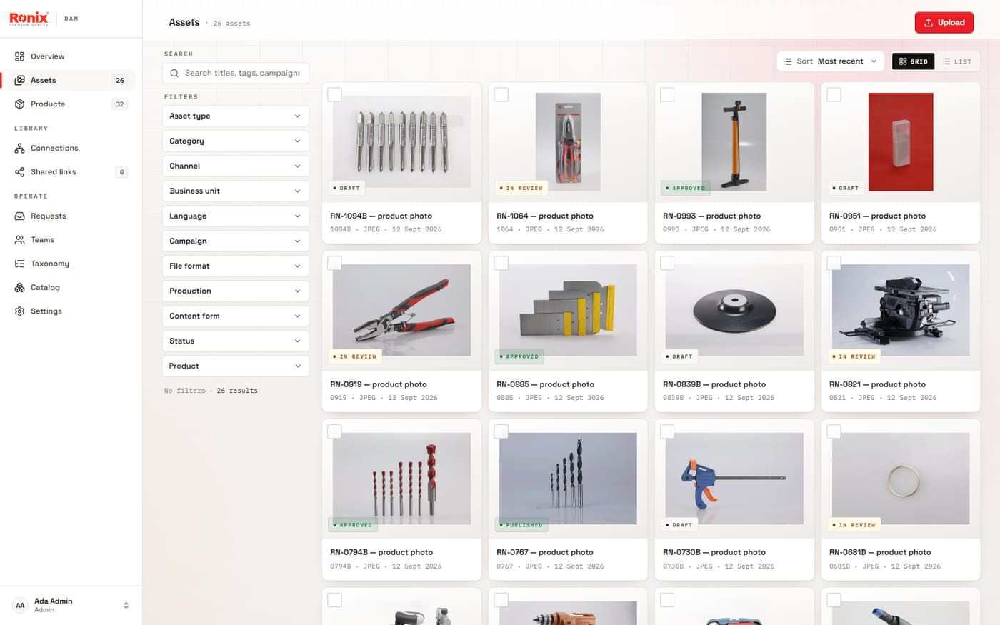
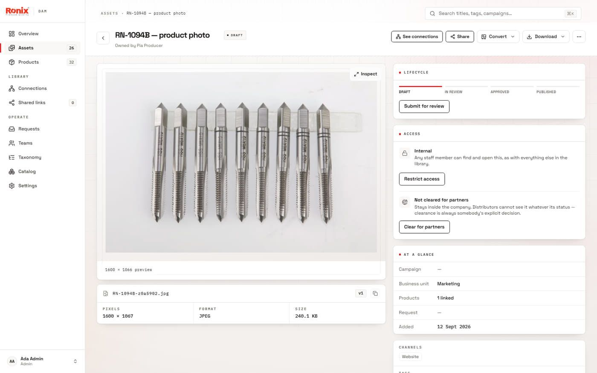
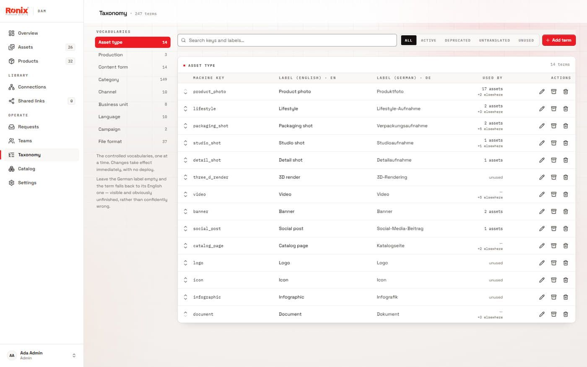

# Ronix DAM: brand asset manager and partner portal

**Distributors stopped emailing for photos.** A digital asset manager for an in-house advertising department, with a portal where a distributor types a product code and downloads exactly the files their store needs.

| | |
|---|---|
| **Role** | Product owner and UX lead, built with [Sam Mehrany](https://sammehrany.com), who wrote most of the code. I owned the brief, the information architecture, the partner-portal and admin redesign, the pre-release audit, and deployment. |
| **When** | July – September 2026 |
| **Stack** | Next.js 16, React 19, TypeScript, self-hosted Supabase (Postgres, auth, storage), Drizzle, sharp, nginx, self-hosted CI runner |
| **Size** | ~79,000 lines · 220 commits · 28 merged pull requests |
| **Status** | Deployed on the company network |

> The source is private company code at Ronix Tools. I'm glad to walk through it in an interview. → [Portfolio](https://arvinabedi.github.io)

## The problem

Approved product photography, labels and manuals sat on a NAS two network hops deep. Every distributor request for a file became an email to the brand team, and nobody could say which version was the approved one.

## What we built

- **Five roles on one library.** Staff upload, tag against a controlled taxonomy and approve. Distributors see only what has been cleared for partners, and clearance is always an explicit decision, never a default.
- **A partner portal with one search box.** A product code in; that product's photos, banners, packaging and manuals out.
- **A controlled vocabulary.** 247 terms across nine vocabularies, in English and German. A missing German label falls back visibly to English instead of being silently wrong.
- **Lifecycle and rights.** Draft → in review → approved → published, versions and renditions per asset, rights windows, and an audit trail.
- **A storage panel** that shows capacity by asset type, so the disk is planned instead of discovered full.

## Then I audited it

Before release I reviewed the build as a hostile user: **thirty findings, three of them critical**, each with evidence and the fix. Then I captured every route as every role, 47 screens, so the next release had a baseline to compare against.

## Screens

Demo data throughout; no real users or partners.

| Admin overview | Partner portal |
|---|---|
|  |  |
| **Asset library** | **Asset detail** |
|  |  |

---

[Portfolio](https://arvinabedi.github.io) · [All case studies](https://github.com/arvinabedi)
